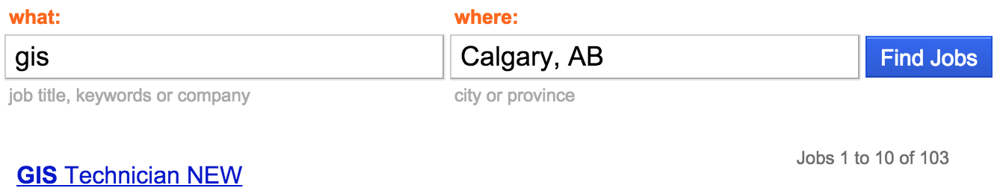
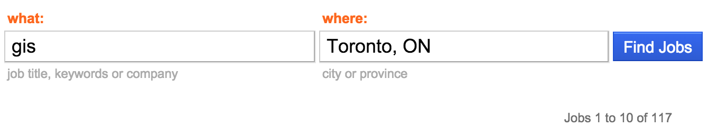
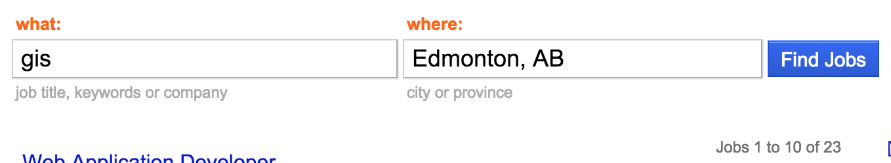
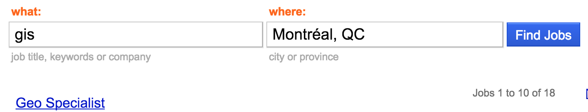
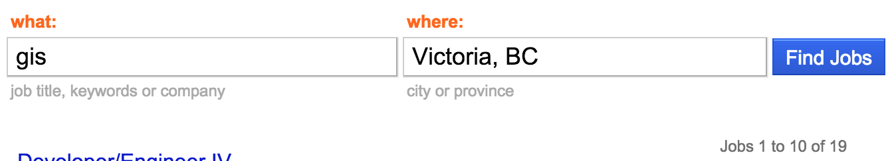

## MaptimeCalgary

### [Meta]

Who, What, When, Where, Why, How... <!-- .element: class="fragment" data-fragment-index="1" -->

_not in that order_ <!-- .element: class="fragment" data-fragment-index="2" -->

## What is Maptime?

[`maptime.io`](maptime.io)
<iframe data-src="http://maptime.io/about/" width="100%" height="60%" />

Maptime is about _learning_.

DIY, on the cheap. <!-- .element: class="fragment" data-fragment-index="1" -->

## Why Maptime?

- <!-- .element: class="fragment" data-fragment-index="1" -->You don't learn _everything_ in school.
- It's kind of difficult to learn things after school. <!-- .element: class="fragment" data-fragment-index="2" -->
- The landscape is kind of overwhelming...  <!-- .element: class="fragment" data-fragment-index="3" -->

# ...

_TODO: A bunch of libraries_

## Topics

- Webmapping (mostly) <!-- .element: class="fragment" data-fragment-index="1" -->
- Straight GIS (?) <!-- .element: class="fragment" data-fragment-index="2" -->
- General programming / technology skills (whatever's needed to get the job done) <!-- .element: class="fragment" data-fragment-index="3" -->

... basically, whatever people want to learn <!-- .element: class="fragment" data-fragment-index="4" -->

## Why MaptimeCalgary?

## Lots of jobs...

I would assume that this would mean alot of geographers <!-- .element: class="fragment" data-fragment-index="1" -->

## Already a networking group

_(This isn't that)_ <!-- .element: class="fragment" data-fragment-index="1" -->
_(Not that there's anything wrong with that)_ <!-- .element: class="fragment" data-fragment-index="2" -->

## What does MaptimeCalgary offer?

- Presentations <!-- .element: class="fragment" data-fragment-index="1" -->
  - Tutorials
  - Show & Tell _("Check out this project I did...")_
- Hack Nights / Office Hours <!-- .element: class="fragment" data-fragment-index="2" -->
  - Work on projects together
  - Get help
- Information/Resource Sharing <!-- .element: class="fragment" data-fragment-index="3" -->
  - _"Where do I get data X?"_
  - _"Anyone know how to do Y?"_

## Who is MaptimeCalgary?

People who show up.

## We are not experts

Just people figuring stuff out.

## How do you get involved?

- <!-- .element: class="fragment" data-fragment-index="1" --> Presentation Topics: [Github Issue (Suggestions)](https://github.com/MaptimeCalgary/maptimecalgary.github.io/labels/presentation%20topic%20suggestion) or [Pull Request (Volunteering)](https://github.com/MaptimeCalgary/maptimecalgary.github.io/pulls)
- <!-- .element: class="fragment" data-fragment-index="2" --> Website: [Github Issue](https://github.com/MaptimeCalgary/maptimecalgary.github.io/issues?q=is%3Aopen+label%3Awebsite+label%3Aenhancement) or [Pull Request](https://github.com/MaptimeCalgary/maptimecalgary.github.io/pulls)  
- <!-- .element: class="fragment" data-fragment-index="3" --> Questions: [GoogleGroups](https://groups.google.com/forum/#!forum/maptimecalgary)  
- <!-- .element: class="fragment" data-fragment-index="4" --> Chatter: Slack? IRC?  
- <!-- .element: class="fragment" data-fragment-index="5" --> Tell Others: [Tweet](https://twitter.com/maptimecalgary)  
-  <!-- .element: class="fragment" data-fragment-index="6" --> Bring Friends: [Meetup](www.meetup.com/MaptimeCalgary/)

## Where and When?

> I dunno, when's good for you?

## Sponsors

- Meetup Space
- $ for food, drink

# End
